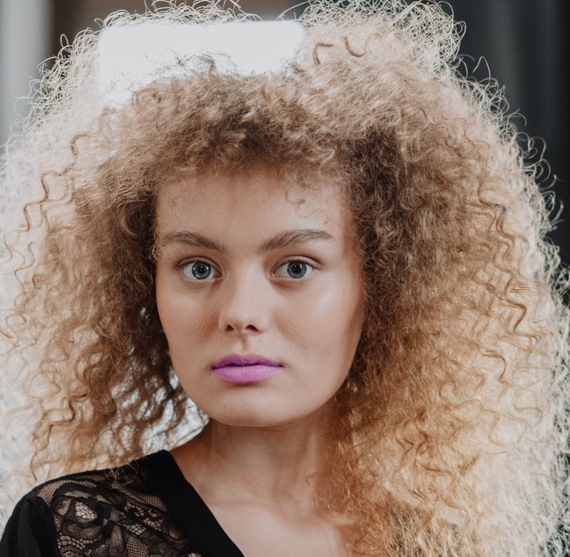
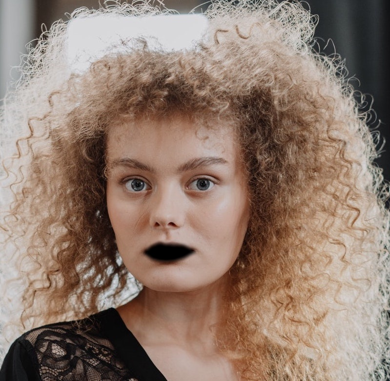
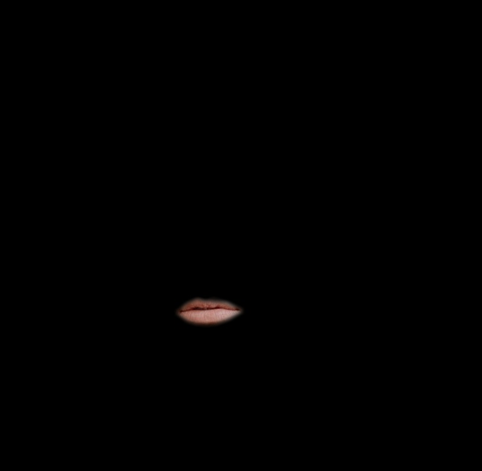

# lipstick
Project1: Virtual Makeup Feature 1.

For get an automatic lipstick algorithm , we will need to follow the following sequence of steps:
- Detect the facial landmarks using:
    > shape_predictor_68_face_landmarks.dat.
- Choose the mouth landmarks and obtain that convex polygon for get a mask.

- Enhance the mask with blur for soft blending.

- Isolate mouth and face.

- Apply color transformation in HSV space using Huge layer on the mouth image.

- Add mouth and face without mouth, for results.
